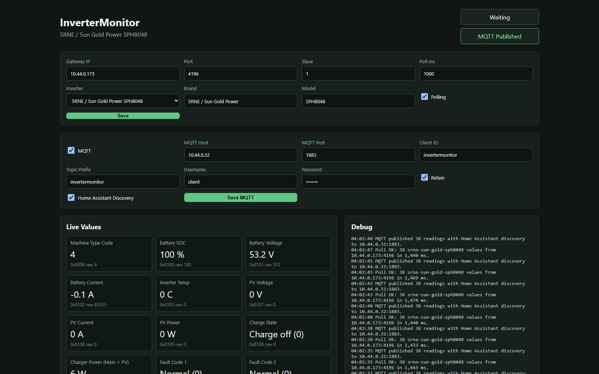

# InverterMonitor

C# Docker-first monitor for my solar inverter, currently targeting an SRNE /
Sun Gold Power inverter over a Waveshare RS232/485/422 TO POE ETH bridge.

The current implementation speaks raw Modbus RTU frames over TCP, matching the
Waveshare `Protocol = None`, `TCP Server`, port `4196` setup.

Basic Web interface for editing config for testing and debugging. Although the pimrary purpose for this container is to bridge the Inverter via the Gateway back to MQTT/Home Assistant. 



## Security Notice

This app is intended only for internal deployment where the network layer is the
security boundary. The web UI and API are unauthenticated by design. Limit access
with Docker networking, VLANs, firewall rules, reverse-proxy authentication, or
similar controls. Do not expose this app directly to the public internet.


## Vibes Warning 

This was primarly thrown together with Codex/GPT 5.5 - it is really just for my personal use, but I am sharing in case it can help you either for reference or your own setup. Please feel free to submit issues or requests, if its something that makes sense within the scope of the project, I probably won't be against it. 

Work done by the agent is reviewed by me but I don't read every single line. Use at your own risk.

## Run Locally

```powershell
dotnet build --configfile .\NuGet.Config
$env:ASPNETCORE_URLS='http://localhost:5099'
.\bin\Debug\net10.0\InverterMonitor.exe
```

Open `http://localhost:5099`.

## Build Container

```powershell
docker build -t invertermonitor .
docker run --rm -p 8080:8080 invertermonitor
```

## Run With Docker Compose

Copy `.env.example` to `.env`, adjust the gateway/MQTT values, then run:

```powershell
docker compose up -d --build
```

Open `http://localhost:8080`.

The container reads initial settings from environment variables using the
`Monitor__...` names in `.env.example`. Settings changed in the web UI apply at
runtime, but are not persisted across container recreation yet.

## Dockhand Or Other Git Stack Docker Managers

For Docker managers that can deploy a Compose stack directly from Git, use:

- Repository: `https://github.com/GaryJS3/InverterMonitor`
- Stack name: `invertermonitor`
- Compose file path: `docker-compose.yml`
- Additional env file: leave blank unless your manager provides one

Set these deploy options:

- Build images on deploy: `ON`
- Re-pull images: `OFF`
- Force redeployment: `OFF`

`Build images on deploy` is required because this repository currently builds
the container image from the included `Dockerfile`. `Re-pull images` is only
needed if the stack is changed later to use a prebuilt registry image such as
`ghcr.io/...:latest`. `Force redeployment` is optional and normally not needed
unless the stack should restart even when Git has no changes.

Add the environment variables from `.env.example` in the manager UI, or provide
an env file through the manager if supported.

## Initial Known Settings

- Gateway: `10.44.0.173`
- Port: `4196`
- Slave: `1`
- Serial bridge mode: raw TCP / transparent / `Protocol = None`
- Serial: `9600 8N1`

MQTT publishing and Home Assistant discovery are wired. Discovery publishes
retained config topics under `homeassistant/sensor/.../config` when enabled.

## Example Live Values

Example values from an SRNE / Sun Gold Power SPH8048:

| Value | Example | Register |
| --- | ---: | --- |
| Machine Type Code | `4` | `0x000B raw 4` |
| Battery SOC | `100 %` | `0x0100 raw 100` |
| Battery Voltage | `53.2 V` | `0x0101 raw 532` |
| Battery Current | `0.3 A` | `0x0102 raw 3` |
| Inverter Temp | `0 C` | `0x0103 raw 0` |
| PV Voltage | `0 V` | `0x0107 raw 0` |
| PV Current | `0 A` | `0x0108 raw 0` |
| PV Power | `0 W` | `0x0109 raw 0` |
| Charge State | `Charge off (0)` | `0x010B raw 0` |
| Charger Power (Main + PV) | `0 W` | `0x010E raw 0` |
| Fault Code 1 | `Normal (0)` | `0x0204 raw 0` |
| Fault Code 2 | `Normal (0)` | `0x0205 raw 0` |
| Current State Of Machine | `Initialization (2)` | `0x0210 raw 2` |
| Grid Voltage | `117.1 V` | `0x0213 raw 1171` |
| AC Current Leg 1 | `24.6 A` | `0x0214 raw 246` |
| Grid Frequency | `59.99 Hz` | `0x0215 raw 5999` |
| Inverter Voltage | `117.1 V` | `0x0216 raw 1171` |
| Inverter Frequency | `59.99 Hz` | `0x0218 raw 5999` |
| AC Current Leg 2 | `24.9 A` | `0x0219 raw 249` |
| Load Apparent Power Leg 1 | `2890 VA` | `0x021B raw 2890` |
| Load Apparent Power Leg 2 | `2985 VA` | `0x021C raw 2985` |
| Load Power Factor | `0.39` | `0x021F raw 39` |
| Nominal Battery Capacity | `100 Ah` | `0xE002 raw 100` |
| Overcharge Voltage | `58 V` | `0xE008 raw 145` |
| Overcharge Return Voltage | `58 V` | `0xE009 raw 145` |
| Over Discharge Return Voltage | `52 V` | `0xE00B raw 130` |
| Over Discharge Voltage | `42 V` | `0xE00D raw 105` |
| Charge Cut-Off SOC | `5 %` | `0xE00F raw 5` |
| Output Priority | `UTI (1)` | `0xE204 raw 1` |
| Charger Priority | `Solar and utility (2)` | `0xE20F raw 2` |
| Power Generation Of The Day | `0 kWh` | `0xF02F raw 0` |
| Load Power Consumption Of The Day | `0.3 kWh` | `0xF030 raw 3` |
| Accumulated Solar Generation | `5951.4 kWh` | `0xF038 raw 59514` |
| Accumulated Load Consumption | `2199 kWh` | `0xF03A raw 21990` |
| Load Apparent Power Total | `5875 VA` | derived |
| Load Real Power Leg 1 Estimate | `1127.1 W` | derived |
| Load Real Power Leg 2 Estimate | `1164.15 W` | derived |
| Load Real Power Estimate | `2291.25 W` | derived |

## Inverter Definitions

Each inverter model lives in `InverterDefinitions/*.json`. A definition includes
brand/model metadata, protocol defaults, read behavior, and register entries.
Register addresses may be decimal strings or hex strings such as `0x021B`.
